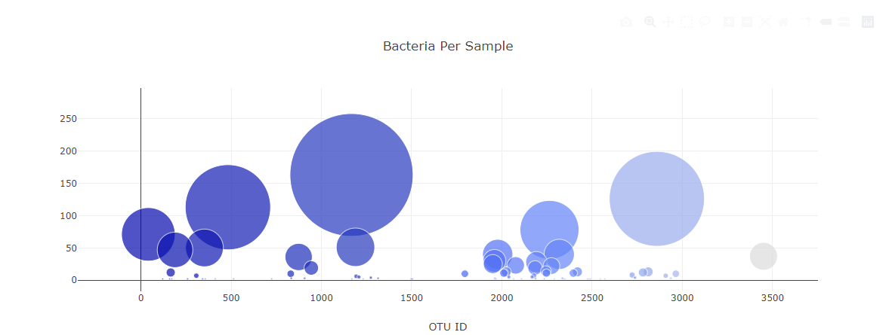

# Belly-Button-Challenge

### In this challenge I was directed to build a dashboard from JSON dataset of bacteria samples retrieved from human navels. The samples were tested for bacteria and the results were documented as part of the data sample.

---

## Plots

The dashboard consists of a dropdown menu to select the test subject id number and displays the subject's demographic information. When the test subject is selected, the components of the dashboard change to reflect the data relevant to the subject.

The bars in the horizontal chart are the top 10 samples taken from the subjec. If the cursor is hoovered over the bars, information on the bacteria found for that sample "OTU" is revealed. A bubble chart shows the amount of bacteria through the size of the markers. The bubbles also have additional information that is displayed when the cursor hoovers.

The code was written using Plotly, JavaScript, HTM, CSS, and the D3.js library.

Here is the link to the [Belly-Button Dashboard](https://jepowers65.github.io/belly-button-challenge/)  
 

## Dynamic Dashboard Elements

---

  
  
  
  
